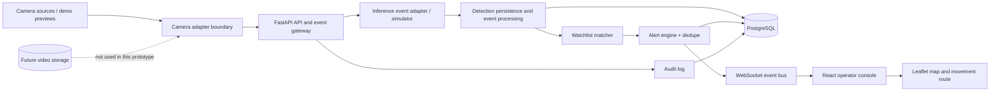

# okDriver Smart Monitoring Prototype

A runnable operator workflow for camera registry and health, synthetic camera previews, ANPR-style event ingestion, watchlist matching, deduplicated alerts, live WebSocket delivery, vehicle movement history, and GIS visualization.

> **Prototype scope:** camera video tiles are generated visual previews, not MP4 footage, CCTV, RTSP, or WebRTC. Detection payloads are synthetic adapter events, not outputs from a trained AI model. The current application is a local demonstration and has not been load-tested for production or 80,000 cameras.

## Quick start

### Docker Compose

Install Docker Desktop, copy `.env.example` to `.env`, replace the local demo secrets if exposing the service, then run:

```sh
docker compose up --build
```

Open <http://localhost:8080>. FastAPI Swagger is at <http://localhost:8080/api/docs> through the frontend proxy (or port 8000 when running the backend directly). PostgreSQL is initialized with the Alembic migration; demo users and sample records are added on backend startup.

### Local development

Requires Python 3.12+, Node.js 20+, and PostgreSQL 16 (or SQLite for a lightweight backend-only run). In separate terminals:

```sh
cd backend
python -m venv .venv
. .venv/bin/activate  # Windows PowerShell: .venv\Scripts\Activate.ps1
pip install -r requirements.txt
alembic upgrade head
uvicorn app.main:app --reload --port 8000
```

```sh
cd frontend
npm install
npm run dev
```

The Vite server listens on port 5173 and proxies API requests to port 8000. Without `DATABASE_URL`, SQLAlchemy uses a local SQLite file. Use PostgreSQL for the Compose path and representative database behavior.

## Demo accounts

These demo-only credentials are seeded on first startup; change them and set a unique `JWT_SECRET` before any shared deployment.

| Role | Username | Password |
|---|---|---|
| Admin | `admin` | `DemoAdmin!2026` |
| Operator | `operator` | `DemoOperator!2026` |

Admin manages camera registry, watchlist, audit log, and users. Operator views operational data and acknowledges/resolves alerts. Both can search vehicles and trigger the visible demo simulator.

## Demo workflow (3–5 minutes)

1. Sign in with the admin demo account and open the command center.
2. Review camera counts, synthetic feed previews, recent detections, and the map.
3. Open Watchlist and note the synthetic `GJ01XX0001` and `GJ05AB1234` entries.
4. Click **Simulate detection**. It sends an ANPR-shaped event through the API, persists it, checks the watchlist, and emits a `detection.created` event. A fresh matching vehicle/camera watchlist alert is persisted and broadcast as `alert.created`.
5. Review the toast and Alerts page; acknowledge and resolve it.
6. Search for `GJ01XX0001` under Vehicle movement to review seeded chronological sightings and the route.
7. Open Cameras to change a camera's health and see the map/dashboard update.
8. Visit `/api/docs` to explore the OpenAPI API.

The simulator chooses an enabled online camera. Existing active alerts within the configured dedupe interval suppress an additional alert for the same watchlist entry and camera; the detection itself is still retained.

## Architecture



FastAPI routes handle request/response and delegate event flow to the ingestion service. SQLAlchemy maps users/roles, cameras/heartbeats, detections, watchlist entries, alerts, and audit logs. The current in-process WebSocket bus is suitable for one API process; it is not a multi-instance pub/sub layer. Browser preview tiles are CSS-generated scene animations labeled synthetic. `MP4_SIMULATOR` is the camera source protocol field for the sample registry; it does not claim that video files are being decoded.

### AI and camera replacement boundaries

`POST /api/v1/detections` accepts validated normalized inference events; `/simulator/detection` emits synthetic examples. Replace the simulator's payload producer with ANPR/model/API/queue consumer while keeping the ingestion/watchlist/alert workflow. A future `CameraSource` adapter should separately implement recorded-file decoding and RTSP ingestion; this prototype does not yet include those stream readers. Stream endpoint credentials are never returned by camera read schemas/routes.

### Database and migrations

The schema uses UUID-string IDs, indexed camera and plate lookups, chronological detection queries, status/time alert queries, and watchlist identifier lookup. Initial schema is in `backend/alembic/versions/0001_initial.py`; upgrade with `cd backend && alembic upgrade head`. Startup also calls SQLAlchemy `create_all` to make disposable SQLite first-run setup straightforward. Entity relationships are shown in [docs/er-diagram.md](docs/er-diagram.md).

## API and events

All business endpoints are versioned under `/api/v1`. OpenAPI/Swagger is served at `/api/docs`; the generated schema is at `/api/openapi.json`.

| Area | Endpoints |
|---|---|
| Authentication | `POST /auth/login`, `GET /auth/me` |
| Camera registry | `GET/POST /cameras`, `GET /cameras/{camera_id}`, `PATCH /cameras/{camera_id}`, status/enable controls, heartbeat history |
| Watchlist | `GET/POST /watchlist`, `PATCH/DELETE /watchlist/{id}` (delete disables) |
| Detection | `GET/POST /detections`, `POST /simulator/detection` |
| Alerts | `GET /alerts`, `GET /alerts/{id}`, `POST /alerts/{id}/acknowledge`, `POST /alerts/{id}/resolve` |
| Search/admin | `GET /vehicles/{vehicle_number}/history`, `GET /audit-logs`, `GET/POST /admin/users`, `GET /dashboard/summary` |
| Health | `GET /health`, `GET /ready` |

Authenticated event clients connect to `ws://host/api/v1/ws`. Each envelope has `event`, `timestamp`, and `data`. Event names: `detection.created`, `alert.created`, `camera.status_changed`. Frontend reconnects after transient disconnection and invalidates operational queries on incoming events.

## Security notes

Passwords use Argon2 hashing via `pwdlib`; API access tokens are signed JWTs with expiry and role claims. Admin-only operations enforce role checks server-side. CORS is environment-configurable, query inputs are typed, stream references are not exposed in camera responses, and operational changes create audit rows. Configure high-entropy secrets, HTTPS/reverse proxy, login and API rate limits, secret rotation, network policy, and production identity integration before deployment. The prototype has no full production rate limiter or refresh-token/session-revocation system.

## Testing

Run `cd backend && pytest -q`. Workflow coverage includes demo login, role authorization, camera input validation/creation, detection-to-watchlist-to-alert integration, duplicate alert suppression, movement history, and alert lifecycle. These tests use a local SQLite test database. Frontend production compilation is `cd frontend && npm run build`.

## Configuration

See [.env.example](.env.example). `DATABASE_URL`, `JWT_SECRET`, `JWT_EXPIRE_MINUTES`, `CORS_ORIGINS`, `DEMO_MODE`, `ALERT_DEDUP_WINDOW_SECONDS`, and PostgreSQL variables are supported. Never commit `.env`. Compose has development-only fallback DB/JWT credentials when `.env` is absent.

## Known limitations and next steps

- Synthetic preview tiles only: no video recording, playback, RTSP, ONVIF, WebRTC, clips, or video storage.
- No trained model or computer vision; integrations must send normalized detection events.
- The in-memory WebSocket event bus is single-process and does not replay missed events.
- No production rate limiter, user admin creation UI, detailed role policy matrix, or PostgreSQL HA.
- Camera edit/watchlist update APIs exist but the current UI emphasizes create, status toggles, search, and review.
- The demo UI uses an OpenStreetMap tile service; provide an approved tile provider and appropriate usage plan in deployment.
- No scale, security, disaster-recovery, or performance benchmark has been run.

See [docs/architecture.md](docs/architecture.md), [docs/scalability.md](docs/scalability.md), and [docs/FINAL_REVIEW.md](docs/FINAL_REVIEW.md) for deployment evolution and requirement-by-requirement evidence.
